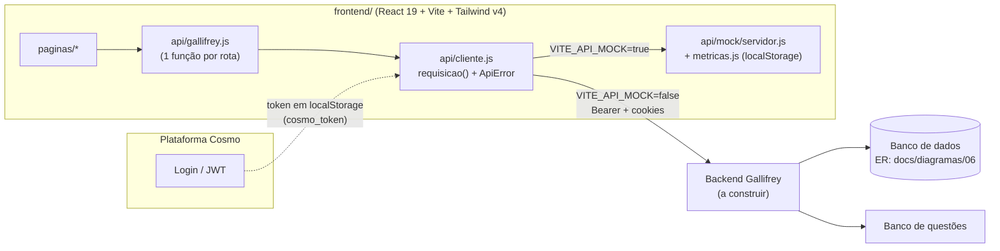
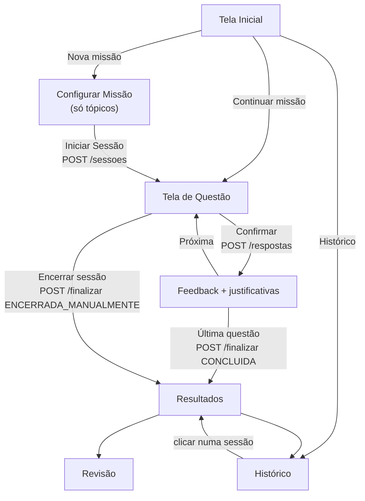

# Gallifrey — Plano do Produto

> **Ponto único de contexto** do Gallifrey: problema, objetivos, escopo, arquitetura, domínios de features,
> decisões, roadmap e convenções. Leia a seção [0. Como usar este documento](#0-como-usar-este-documento) antes de
> qualquer tarefa.
>
> Última revisão: **2026-09-27** · Estado: frontend completo com backend simulado; backend real ainda não existe.

---

## Sumário

0. [Como usar este documento](#0-como-usar-este-documento)
1. [Visão geral e problema](#1-visão-geral-e-problema)
2. [Objetivos](#2-objetivos)
3. [Escopo](#3-escopo)
4. [Arquitetura](#4-arquitetura)
5. [Domínios de features](#5-domínios-de-features)
6. [Integrações](#6-integrações)
7. [Decisões de produto e design](#7-decisões-de-produto-e-design)
8. [Divergências com a documentação antiga](#8-divergências-com-a-documentação-antiga)
9. [Roadmap](#9-roadmap)
10. [Convenções de desenvolvimento](#10-convenções-de-desenvolvimento)
11. [Glossário](#11-glossário)

---

## 0. Como usar este documento

### Para que serve

Este arquivo reúne, num lugar só, o que é preciso saber para trabalhar em **qualquer domínio** do Gallifrey. Os
outros documentos continuam valendo, mas cada um cobre uma parte:

| Documento | O que tem | Quando abrir |
|---|---|---|
| **`gallifrey-plan.md`** (este) | Visão, escopo, domínios, decisões, roadmap, convenções | Sempre primeiro |
| [`docs/contrato-api.md`](docs/contrato-api.md) | Rotas, JSON, códigos de erro e fórmulas das métricas | Ao mexer em API, mock ou backend |
| [`frontend/README.md`](frontend/README.md) | Como rodar, variáveis de ambiente, estrutura de pastas | Ao configurar o ambiente |
| `docs/Documentação Funcional — Gallifrey.docx` | Fluxos funcionais e dados coletados (versão original) | Para entender a motivação dos dados |
| `docs/Requisitos Técnicos, Modelagem de Dados e Critérios de Aceitação — Gallifrey.docx` | Requisitos, ER inicial, critérios de aceitação (versão original) | Para validar critérios |
| `docs/diagramas/*.jpg` | Fluxos 01–05 e modelo ER (06) | Para visualizar fluxos |
| `frontend/src/api/mock/metricas.js` | Implementação de referência dos cálculos | Na dúvida sobre um número |

### Regra de precedência

Quando dois documentos discordarem, vale esta ordem:

1. **Este arquivo** (decisões registradas na [seção 7](#7-decisões-de-produto-e-design)).
2. **`docs/contrato-api.md`** e o **código + testes** do mock (`frontend/src/api/mock/`).
3. Os `.docx` e os diagramas, que são a **versão original** e têm trechos desatualizados, listados na
   [seção 8](#8-divergências-com-a-documentação-antiga).

> ⚠️ **Não existe mais escolha de nível cognitivo nem de quantidade de questões.** O aluno escolhe só os tópicos;
> toda sessão mistura Análise e Avaliação e tem 10 questões. Os `.docx` e o diagrama 02 ainda mostram essas
> escolhas: ignore-as.

### Como trabalhar com ele

- **Antes de uma tarefa:** leia as seções 1–4 e a subseção do domínio afetado na [seção 5](#5-domínios-de-features).
  Cada domínio lista regras, arquivos, rotas e critérios de aceitação.
- **Ao tomar uma decisão de produto** (mudar uma regra, remover ou adicionar funcionalidade): registre-a na
  [seção 7](#7-decisões-de-produto-e-design) no formato `D-NN`. Atualize também o domínio afetado e, se mudar a API,
  o `docs/contrato-api.md` **no mesmo commit/PR**.
- **Ao concluir um item do roadmap:** marque `[x]` na [seção 9](#9-roadmap) e mova o que foi entregue para o
  "Estado atual" do domínio.
- **Ao encontrar um documento desatualizado:** adicione uma linha na [seção 8](#8-divergências-com-a-documentação-antiga).
- **Para agentes de IA (Claude Code etc.):** trate este arquivo como a fonte de contexto do projeto. Não reintroduza
  funcionalidades marcadas como removidas na seção 7, mesmo que apareçam nos `.docx`. Ao alterar regras, mantenha
  este arquivo, o contrato, os tipos JSDoc (`api/tipos.js`) e o mock sincronizados.
- Mantenha o texto em **português**, curto e factual. O que ainda não foi decidido fica marcado como
  **(a definir)** ou **(proposta)**, nunca como fato.

---

## 1. Visão geral e problema

**Gallifrey** é o módulo de **missões** de questões de múltipla escolha de **Python** da plataforma educacional
**Cosmo**, voltado à disciplina **Algoritmos I** do curso **ABI — Ciência da Computação e IA**. Faz parte do TCC.

O nome vem de Doctor Who (planeta natal do Doctor): cada sessão é uma "viagem" pelo universo do Python e cada
**tópico é um planeta**.

### Problemas que resolve

| Problema | Como o Gallifrey responde |
|---|---|
| O aluno não sabe em **quais assuntos** tem mais dificuldade | Acertos/erros ficam ligados ao **tópico da questão** → "Análise por Tópico" e "Ponto de Atenção" |
| A dificuldade cadastrada da questão nem sempre é a **dificuldade real** percebida | **Tempo por questão** medido do instante em que ela aparece até a confirmação |
| Não há visibilidade do **engajamento** (retenção, uso concentrado antes da prova) | **Tempo total** e **número de sessões**, com histórico por período |
| Exercícios soltos não mostram **evolução** | **Histórico de Sessões** com gráfico de evolução do aproveitamento e comparação com a sessão anterior |
| Perda de progresso ao fechar a aba | **Persistência incremental** (cada resposta é gravada na hora) e "Continuar missão" |

### Os 4 dados coletados

| Dado | Captura | Onde aparece |
|---|---|---|
| Tempo na questão | Da exibição (`exibida_em`, servidor) à confirmação | Cronômetro da questão; tempo médio em Resultados e Histórico |
| Tempo total | Soma dos tempos das questões da sessão | Cronômetro da sessão; "Tempo Total" (Resultados); "Tempo Total de Estudo" (Histórico) |
| Número de sessões | Clique em **Iniciar Sessão** (e só nele) | "Sessões Realizadas" (Resultados); "Total de Sessões" (Histórico) |
| Acertos/erros | Cada resposta confirmada, comparada ao gabarito | Rodapé da Questão; Resultados; Histórico |

---

## 2. Objetivos

### Objetivos de produto

1. **Diagnóstico por tópico:** mostrar ao aluno o que revisar, com base na proporção de erros por tópico.
2. **Medição confiável de tempo:** tempo oficial calculado no servidor, imune a lentidão de rede ou relógio do aluno.
3. **Hábito de estudo:** deixar visível a frequência e a evolução (sessões, tempo, aproveitamento ao longo do tempo).
4. **Aprendizado pelo feedback:** justificativa de **todas** as alternativas logo após cada resposta.
5. **Experiência coesa com a Cosmo:** mesma identidade visual, autenticação da Cosmo, servido em subcaminho.

### Objetivos técnicos

- **Consistência dos números:** Resultados e Histórico mostram sempre os mesmos valores para a mesma sessão, porque
  tudo é **derivado** de `RESPOSTA_SESSAO` e nada agregado é gravado.
- **Frontend independente do backend:** o app funciona de ponta a ponta com o mock, que é a implementação de
  referência do contrato.
- **Recalculável:** dados guardados no nível mais fino (uma linha por resposta), em UTC, sem sobrescrever sessões
  antigas.
- **Acessível:** navegação completa por teclado, foco visível, `prefers-reduced-motion`, gráficos com descrição textual.

### Indicadores de sucesso (proposta)

- Aluno consegue configurar, resolver 10 questões e ver resultados sem ajuda.
- 100% dos critérios de aceitação da [seção 10.4](#104-critérios-de-aceitação) atendidos pelo backend real.
- Resultados abertos a partir do Histórico idênticos aos originais (teste automatizado).

---

## 3. Escopo

### Incluído

- Configurar missão escolhendo **um ou mais tópicos** (padrão: todos selecionados).
- Sessão com **10 questões fixas**, sorteadas dos tópicos escolhidos, **misturando todos os níveis cognitivos**.
- Tela de Questão: enunciado com 0–2 trechos de código Python com realce, 4 alternativas (A–D), cronômetro da
  questão e da sessão, pontos de progresso, atalhos de teclado, feedback com justificativas.
- Encerrar a sessão antes do fim (métricas só com as respondidas).
- Retomar sessão em andamento ("Continuar missão").
- Tela de Resultados: aproveitamento, acertos/erros, tempo total, tempo médio, comparação com a sessão anterior,
  sessões realizadas, análise por tópico, ponto de atenção, mini-gráfico do tempo médio das últimas 5 sessões.
- Revisão da sessão ("Ver todas as questões" / "Ver questões erradas").
- Histórico de Sessões com filtro **7 dias / 30 dias / Tudo**: estatísticas, lista de sessões, evolução do
  aproveitamento e desempenho por tópico.
- Página 404 ("Vórtice do Tempo").
- Backend simulado no navegador (`localStorage`) com ~9 sessões de exemplo.

### Fora do escopo (hoje)

| Item | Motivo / observação |
|---|---|
| Escolha de **nível cognitivo** pelo aluno | Removida em 2026-09-27 ([D-01](#7-decisões-de-produto-e-design)). O nível segue existindo na questão (selo Bloom) |
| Escolha da **quantidade de questões** | Removida em 2026-09-27 ([D-02](#7-decisões-de-produto-e-design)). Fixa em 10 |
| Página **Sobre** | Removida em 2026-09-27 ([D-03](#7-decisões-de-produto-e-design)) |
| Login / cadastro | É responsabilidade da Cosmo |
| Cadastro/edição de questões (painel administrativo) | Banco de questões é integração; ver roadmap de longo prazo |
| Visão do professor / turma | Roadmap de longo prazo (proposta) |
| Outros tipos de questão (aberta, código executável) | Só múltipla escolha A–D |
| Outras disciplinas além de Algoritmos I | Roadmap de longo prazo (proposta) |
| Tempo máximo por questão / "questão abandonada" | Ponto em aberto ([P-02](#pontos-em-aberto)) |
| Modo offline | Não previsto |

---

## 4. Arquitetura

### Visão de componentes



| Camada | Responsabilidade | Onde |
|---|---|---|
| Páginas | Uma por tela do fluxo; orquestram estado e chamadas | `frontend/src/paginas/` |
| Componentes | Visuais, organizados por domínio (`questao/`, `metricas/`, `configuracao/`, `ui/`, `layout/`, `cosmo/`, `whovian/`, `inicio/`) | `frontend/src/components/` |
| Lógica pura | Regras sem React, testáveis | `components/questao/logicaQuestao.js`, `lib/`, `api/mock/metricas.js` |
| Acesso à API | Uma função por rota; páginas **nunca** chamam `fetch` | `frontend/src/api/gallifrey.js` |
| Cliente HTTP | Base URL, token, erros padronizados, desvio para o mock | `frontend/src/api/cliente.js` |
| Tipos | JSDoc de todos os formatos do contrato | `frontend/src/api/tipos.js` |
| Mock | Backend no navegador; referência executável do contrato | `frontend/src/api/mock/` |
| Hooks | `useRecurso` (carregamento com cancelamento), `useCronometro` | `frontend/src/hooks/` |
| Contexto | Aluno autenticado (`GET /alunos/me`) | `frontend/src/contexto/AlunoContexto.jsx` |
| Configuração | Variáveis `VITE_*` e constantes de produto | `frontend/src/config.js` |

### Stack

- **Frontend:** React 19, Vite 8, Tailwind CSS v4 (tema em `src/index.css` via `@theme`), `react-router-dom` 7,
  `lucide-react`, fontes Inter / Audiowide / JetBrains Mono. JavaScript/JSX com tipos em JSDoc (sem TypeScript).
- **Qualidade:** Vitest + Testing Library + jsdom; oxlint.
- **Backend:** **(a definir)** — linguagem, framework e banco ainda não escolhidos. Deve seguir `docs/contrato-api.md`.

### Rotas do frontend

| Rota | Tela | Domínio |
|---|---|---|
| `/` | Tela Inicial | [5.1](#51-tela-inicial-e-retomada) |
| `/missao/nova` | Configurar Missão | [5.2](#52-configurar-missão) |
| `/missao/:sessaoId` | Tela de Questão (cabeçalho próprio) | [5.3](#53-resolução-de-questão) |
| `/missao/:sessaoId/resultado` | Tela de Resultados | [5.4](#54-finalização-e-resultados) |
| `/missao/:sessaoId/revisao` (`?filtro=erradas`) | Revisão | [5.5](#55-revisão-da-sessão) |
| `/historico` (`?periodo=7d\|30d\|tudo`) | Histórico de Sessões | [5.6](#56-histórico-de-sessões) |
| `*` | 404 (Vórtice do Tempo) | — |

Todas as páginas são carregadas sob demanda (`lazy` + `Suspense`) em `App.jsx`.

### Fluxo principal



### Modelo de dados (resumo)

Baseado no ER (`docs/diagramas/fluxos_gallifrey-06`), **sem** `nivel_cognitivo` na sessão:

| Entidade | Campos principais | Observação |
|---|---|---|
| `ALUNO` | id, nome, email, data_cadastro | Estatísticas **derivadas**, nunca gravadas |
| `SESSAO` | id, aluno_id, data_inicio, data_fim, status, num_questoes_configuradas | `status`: `EM_ANDAMENTO`, `CONCLUIDA`, `ENCERRADA_MANUALMENTE` |
| `TOPICO` | id, nome | 6 tópicos no banco de exemplo |
| `SESSAO_TOPICO` | sessao_id, topico_id | N:M |
| `QUESTAO` | id, topico_id, nivel_cognitivo, enunciado, codigos, alternativas, alternativa_correta | `nivel_cognitivo`: `ANALISE`, `AVALIACAO` |
| `RESPOSTA_SESSAO` | id, sessao_id, questao_id, alternativa_escolhida, correta, tempo_gasto_segundos, timestamp_resposta | **Registro central** de todas as métricas |
| `SESSAO_QUESTAO` *(sugerido)* | sessao_id, questao_id, ordem, exibida_em | Lote fixo + início oficial do cronômetro |
| `ALTERNATIVA` *(sugerido)* | questao_id, letra, texto, justificativa, correta | Justificativa por alternativa |
| + em `RESPOSTA_SESSAO` *(sugerido)* | ordem, tempo_cliente_segundos, tempo_oculto_segundos | Dados para os pontos em aberto |

---

## 5. Domínios de features

Cada domínio tem: **objetivo**, **regras**, **arquivos**, **API**, **estado atual** e **critérios de aceitação**.

### 5.1 Tela Inicial e retomada

- **Objetivo:** ponto de entrada; mostrar estatísticas do aluno e permitir continuar uma missão interrompida.
- **Regras:**
  - Se houver sessão `EM_ANDAMENTO`, oferecer **"Continuar missão"** (`GET /sessoes/em-andamento` → `204` se não houver).
  - Estatísticas vêm de `GET /alunos/me` (`estatisticas` derivadas).
- **Arquivos:** `paginas/Inicio.jsx`, `components/inicio/FigurasHero.jsx`, `contexto/AlunoContexto.jsx`.
- **Estado atual:** ✅ implementado com mock.
- **Aceitação:** com sessão em andamento, o botão leva à questão atual **sem zerar o cronômetro**; sem sessão, não
  aparece.

### 5.2 Configurar Missão

- **Objetivo:** montar a rota de planetas (tópicos) e iniciar a sessão.
- **Regras:**
  - O aluno escolhe **apenas tópicos** (≥ 1). Padrão: todos selecionados; há "Selecionar todos" e "Limpar".
  - **Não há** escolha de nível cognitivo nem de quantidade de questões.
  - Configurar **não** chama o servidor para criar nada. A sessão nasce **só** no clique em **Iniciar Sessão**
    (`POST /sessoes` com `{ "topico_ids": [...] }`), que é o único momento em que `num_sessoes` aumenta.
  - O resumo mostra tópicos, **10 questões** (`NUM_QUESTOES_POR_SESSAO`) e tempo estimado
    (`SEGUNDOS_ESTIMADOS_POR_QUESTAO` = 90 s → ~15 min), além do card "Última sessão" (`GET /sessoes/ultima`).
  - Backend sorteia o lote filtrando **só por tópico**, com todos os níveis; recomendado intercalar tópicos e
    priorizar questões inéditas para o aluno. Lote menor se faltar questão; nenhuma → `422 SEM_QUESTOES`.
  - Se já existir sessão `EM_ANDAMENTO`, o mock a encerra como `ENCERRADA_MANUALMENTE` (política sugerida).
  - Overlay "Materializando TARDIS…" com duração mínima de 900 ms (0 com `prefers-reduced-motion`).
- **Arquivos:** `paginas/ConfigurarMissao.jsx`, `components/configuracao/{RotaDePlanetas,ResumoSessao,OverlayMaterializando}.jsx`,
  `config.js`.
- **Estado atual:** ✅ implementado; simplificado em 2026-09-27 (D-01, D-02).
- **Aceitação:** botão desabilitado e mensagem "Selecione pelo menos um tópico" sem tópicos; ao iniciar, sessão
  criada com `data_inicio` (UTC) e `num_questoes_configuradas = 10`; o cliente não envia nível nem quantidade (e o
  backend ignora se receber).

### 5.3 Resolução de questão

- **Objetivo:** fluxo central de coleta de tempo e acertos/erros.
- **Regras:**
  - `POST /sessoes/{id}/questoes/proxima` marca `exibida_em` e devolve a questão **sem gabarito**. É **idempotente**:
    recarregar devolve a mesma questão com o `exibida_em` original.
  - O cronômetro da questão parte de `servidor_agora − exibida_em` (corrige relógio e recarga) e **congela** no
    clique em Confirmar; tempo lendo o feedback **não conta**.
  - Cronômetro da sessão = soma dos tempos das questões respondidas (`progresso.tempo_total_segundos`).
  - `POST /respostas` envia `questao_id`, `alternativa_escolhida`, `tempo_cliente_segundos`, `tempo_oculto_segundos`.
    **Tempo oficial = `timestamp_resposta − exibida_em`, calculado no servidor.**
  - Resposta gravada **imediatamente** (persistência incremental). Duplicada → `409 QUESTAO_JA_RESPONDIDA`.
  - Feedback mostra correta/incorreta e a **justificativa de todas as alternativas**; gabarito só chega depois da resposta.
  - Acerto/erro vinculado ao **tópico da questão**.
  - Selo mostra tópico e nível cognitivo (Análise/Avaliação) da questão — informativo.
  - "Encerrar sessão" (com modal de confirmação) finaliza com as respondidas até ali.
  - Teclado: `1–4` / `A–D` escolhem, `Enter` confirma/avança. Ao voltar para a aba: aviso "Não pisque!".
- **Arquivos:** `paginas/Questao.jsx`, `components/questao/*`, `hooks/useCronometro.js`,
  `components/questao/logicaQuestao.js` (+ `.test.js`), `components/ui/TextoComCodigo.jsx`.
- **Estado atual:** ✅ implementado com mock.
- **Aceitação:** Critérios §3.2 (ver [10.4](#104-critérios-de-aceitação)).

### 5.4 Finalização e Resultados

- **Objetivo:** calcular e exibir as métricas da sessão.
- **Regras:**
  - Disparada ao responder a última questão (`motivo: CONCLUIDA`) ou por "Encerrar sessão"
    (`ENCERRADA_MANUALMENTE`). Idempotente; devolve `ResultadoSessao`.
  - Fórmulas (fonte: `docs/contrato-api.md` §2.10 e `api/mock/metricas.js`):
    - aproveitamento = `acertos / respondidas × 100` (0 sem respostas; 1 casa decimal);
    - tempo médio = `round(tempo_total / respondidas)`;
    - desempenho por tópico: só tópicos com respostas, ordenados por id;
    - **ponto de atenção** = maior **proporção** de erros; desempate: mais erros, depois mais respondidas; `null` sem erros;
    - comparação = sessão **finalizada imediatamente anterior** (por `data_inicio`) com ≥ 1 resposta; diferença = atual − anterior;
    - `tempo_medio_ultimas_sessoes`: até 5, cronológicas, terminando na atual.
  - Mensagens de desempenho por faixa ("Fantástico!", "Brilhante!", "Allons-y!", "Geronimo!") em `lib/doctorWho.js`.
- **Arquivos:** `paginas/Resultados.jsx`, `components/metricas/*`, `api/mock/metricas.js`.
- **Estado atual:** ✅ implementado com mock.
- **Aceitação:** Critérios §3.3; abrir a mesma sessão pelo Histórico mostra **os mesmos números**.

### 5.5 Revisão da sessão

- **Objetivo:** rever cada questão respondida com a alternativa escolhida, a correta e as justificativas.
- **Regras:** `GET /sessoes/{id}/respostas` em ordem; abas "Todas" / "Erradas" (`?filtro=erradas`); navegação por
  número da questão. Em questões "Código A × Código B", `situacaoDosCodigos` marca cada trecho como correto/incorreto
  quando o texto da alternativa correta é inequívoco.
- **Arquivos:** `paginas/Revisao.jsx`, `components/questao/*`.
- **Estado atual:** ✅ implementado com mock.

### 5.6 Histórico de Sessões

- **Objetivo:** mostrar evolução e hábitos ao longo do tempo.
- **Regras:**
  - Filtro `7d` (7×24 h), `30d` (30×24 h), `tudo`, aplicado sobre `data_inicio` (UTC). **Todos** os blocos são
    recalculados juntos com as mesmas sessões.
  - Lista da mais recente para a mais antiga; evolução em ordem cronológica, só sessões com respostas.
  - `questoes_unicas` = questões distintas na janela; `questoes_repetidas` = respostas − únicas.
  - `tempo_medio_por_sessao` = tempo total ÷ sessões com ≥ 1 resposta.
  - `sessoes_mes_atual` independe do filtro; `variacao_taxa_acerto_pp` compara com a janela anterior de mesmo tamanho
    (`null` em `tudo`).
  - Clicar numa sessão abre `/missao/:id/resultado`. Diário vazio: "Spoilers!".
- **Arquivos:** `paginas/Historico.jsx`, `components/metricas/{GraficoEvolucao,LinhaSessao,ListaDesempenhoTopico,CartaoMetrica}.jsx`.
- **Estado atual:** ✅ implementado com mock.
- **Aceitação:** Critérios §3.4.

### 5.7 Aluno e autenticação

- **Objetivo:** identificar o aluno para vincular sessões e métricas.
- **Regras:** login é da **Cosmo**. O cliente envia `Authorization: Bearer <token>` (token de
  `localStorage[VITE_AUTH_TOKEN_KEY]`, padrão `cosmo_token`) e `credentials: 'include'`. Pode-se trocar a origem do
  token com `definirProvedorDeToken()`. Sem aluno → `401 NAO_AUTENTICADO`. Sessão de outro aluno → `404` (não revelar
  existência).
- **Arquivos:** `api/cliente.js`, `contexto/AlunoContexto.jsx`, `components/layout/Cabecalho.jsx`.
- **Estado atual:** 🟡 pronto no frontend; integração real com a Cosmo pendente.

### 5.8 Banco de questões

- **Objetivo:** fornecer questões vinculadas a **um tópico** e **um nível cognitivo**, com gabarito e justificativas.
- **Regras:** alternativas A–D; `codigos` com 0–2 trechos (`rotulo`, `linguagem`, `conteudo`); textos aceitam
  `` `código inline` `` e `\n`. Nunca enviar `alternativa_correta`/justificativas antes da resposta.
- **Estado atual:** 🟡 banco de exemplo com **60 questões** (6 tópicos × 10; 30 Análise, 30 Avaliação) em
  `api/mock/data/questoes.json`. Origem do banco real **(a definir)**.
- **Tópicos atuais:** Variáveis, Tipos Primitivos, Atribuições, Condicionais SE, Operadores, Boas Práticas.

### 5.9 Identidade visual e acessibilidade

- **Objetivo:** experiência coerente com a Cosmo, com referências a Doctor Who.
- **Regras:**
  - Paleta, planetas, astronauta, cometa, satélite e foguete vêm da Cosmo; cada **tópico é um planeta**
    (`lib/visualTopico.js`, estável por id).
  - Doctor Who: TARDIS "materializando" nos carregamentos, anéis gallifreyanos, mensagens de desempenho, "Não pisque!",
    "Spoilers!", 404 no Vórtice do Tempo. **Todos os desenhos são próprios** (nenhuma arte oficial da série).
  - Paleta suavizada (sem laranja/vermelho saturado nem magenta forte); erro usa rosa (`--color-erro`).
  - Tokens de cor, fonte, sombra e animação ficam em `src/index.css` (`@theme`): `cosmo-*`, `espaco-*`, `acerto`,
    `erro`, `atencao`, `tardis`.
  - Acessibilidade: teclado, foco visível, `prefers-reduced-motion`, semântica radio/checkbox, `aria-*` nos grupos,
    gráficos SVG com descrição textual.
- **Arquivos:** `src/index.css`, `components/{cosmo,whovian,layout}/`, `assets/cosmo/`, `lib/doctorWho.js`.
- Os protótipos (Figma/Cosmo) ficam em `docs/prototipo/`, **fora do git** (`.gitignore`).

---

## 6. Integrações

| Integração | Direção | Estado | Detalhes |
|---|---|---|---|
| **Cosmo — autenticação** | Cosmo → Gallifrey | 🟡 Preparada | JWT via `localStorage` + cookies; `definirProvedorDeToken` para outra fonte |
| **Cosmo — hospedagem** | Gallifrey dentro da Cosmo | 🟡 Preparada | `VITE_BASE_PATH` (ex.: `/gallifrey/`) usado no `base` do Vite e no `basename` do router |
| **Backend Gallifrey** | Frontend → API | 🔴 Não iniciado | Seguir `docs/contrato-api.md`; `VITE_API_MOCK=false` + `VITE_API_URL` |
| **Banco de questões** | Backend → base de questões | 🔴 A definir | Formato de referência em `api/mock/data/questoes.json` |
| **Proxy de desenvolvimento** | Vite → backend local | ✅ | `VITE_API_PROXY_TARGET=http://localhost:8000` repassa `/api` |

### Variáveis de ambiente

| Variável | Padrão | Uso |
|---|---|---|
| `VITE_API_URL` | `/api` | Base das rotas |
| `VITE_API_MOCK` | `true` | Backend simulado no navegador |
| `VITE_API_MOCK_LATENCIA` | `250` | Latência artificial do mock (ms) |
| `VITE_API_PROXY_TARGET` | — | Proxy de `/api` no `npm run dev` |
| `VITE_BASE_PATH` | `/` | Subcaminho dentro da Cosmo |
| `VITE_AUTH_TOKEN_KEY` | `cosmo_token` | Chave do token no `localStorage` |
| `VITE_PAUSAR_CRONOMETRO_ABA_OCULTA` | `false` | Pausa só a **exibição** com a aba oculta (ver P-01) |

### Contrato da API (resumo)

`GET /alunos/me` · `GET /topicos` · `GET /sessoes/ultima` · `GET /sessoes/em-andamento` · `POST /sessoes` ·
`GET /sessoes/{id}` · `POST /sessoes/{id}/questoes/proxima` · `POST /sessoes/{id}/respostas` ·
`POST /sessoes/{id}/finalizar` · `GET /sessoes/{id}/resultado` · `GET /sessoes/{id}/respostas` ·
`GET /historico?periodo=`

Convenções: JSON `snake_case` em português; datas ISO 8601 UTC com `Z`; durações em segundos inteiros
(`_segundos`); percentuais 0–100 com 1 casa; "não há" → `204`; erros `{ "erro": { "codigo", "mensagem", "detalhes" } }`
com mensagem em português simples. Detalhes completos: [`docs/contrato-api.md`](docs/contrato-api.md).

---

## 7. Decisões de produto e design

Formato: `D-NN — título (data)` · decisão · motivo · impacto. Decisões novas entram **no fim** da lista.

| ID | Data | Decisão | Motivo | Impacto |
|---|---|---|---|---|
| D-01 | 2026-09-27 | **Remover a escolha de nível cognitivo.** Toda sessão sorteia questões de **todos** os níveis (Análise e Avaliação) | Simplificar a configuração e garantir que o aluno pratique os dois níveis | Sai a seção da tela, `nivel_cognitivo` do `POST /sessoes`, de `Sessao` e `SessaoResumo`. O nível continua **na questão** (selo) |
| D-02 | 2026-09-27 | **Quantidade fixa de 10 questões por sessão**, aplicada pelo backend | Sessões comparáveis entre si e configuração mais rápida | Sai `num_questoes` do `POST /sessoes`; `NUM_QUESTOES_POR_SESSAO` no frontend deve ser igual ao do backend |
| D-03 | 2026-09-27 | **Remover a página Sobre** | Conteúdo não essencial ao fluxo | Sai `/sobre` e o link do cabeçalho |
| D-04 | 2026-09 | **Tempo oficial calculado no servidor** (`timestamp_resposta − exibida_em`); cliente envia seu tempo e o tempo oculto só como referência | Evitar manipulação e distorção por rede/dispositivo (Requisitos §1.1) | `exibida_em` persistido por questão da sessão |
| D-05 | 2026-09 | **Nada agregado é gravado**; tudo deriva de `RESPOSTA_SESSAO` | Resultados e Histórico sempre consistentes; regras recalculáveis | Backend calcula métricas a cada consulta |
| D-06 | 2026-09 | **Persistência incremental** de cada resposta | Não perder dados ao fechar a aba | "Continuar missão" e sessões parciais aproveitáveis |
| D-07 | 2026-09 | **Tempo lendo o feedback não conta**; tempo da sessão = soma dos tempos das questões | Resolve ponto aberto §6.4 da Doc. Funcional | Cronômetro congela na confirmação |
| D-08 | 2026-09 | **Questões únicas vs. repetidas:** únicas = distintas na janela; repetidas = respostas − únicas | Resolve ponto aberto §6.3 | Cálculo em `unicasERepetidas` |
| D-09 | 2026-09 | **Ponto de atenção = maior proporção de erros** (não o maior número absoluto) | Critério §3.3; evita favorecer tópicos com mais questões | Desempate: mais erros, depois mais respondidas |
| D-10 | 2026-09 | **Frontend com mock completo** no navegador, implementação de referência do contrato | Desenvolver e demonstrar sem backend | Mock fica fora do bundle com `VITE_API_MOCK=false` |
| D-11 | 2026-09 | **Iniciar nova sessão com outra em andamento encerra a anterior** (`ENCERRADA_MANUALMENTE`) no mock | Evitar duas sessões simultâneas | Sugestão; o backend pode adotar outra política |
| D-12 | 2026-09 | **Tópico = planeta; identidade Cosmo + Doctor Who com arte própria** | Coerência com a Cosmo e tema do nome | Sem uso de arte oficial da série |
| D-13 | 2026-09 | **JavaScript + JSDoc**, sem TypeScript; nomes em português | Simplicidade e alinhamento com o domínio | Tipos em `api/tipos.js` |

### Pontos em aberto

| ID | Pergunta | Situação atual |
|---|---|---|
| P-01 | Pausar o cronômetro com a aba oculta / inatividade? | Tempo oculto sempre medido e enviado (`tempo_oculto_segundos`); exibição configurável. **Backend decide** se subtrai do oficial |
| P-02 | Tempo máximo por questão antes de considerá-la "abandonada"? | Nada imposto. Se definido, limitar `tempo_gasto_segundos` no servidor |
| P-03 | Política quando já existe sessão em andamento ao iniciar outra | Mock encerra a anterior (D-11); confirmar no backend |
| P-04 | Stack do backend e origem do banco de questões | **(a definir)** |

---

## 8. Divergências com a documentação antiga

Os itens abaixo estão **desatualizados** nos documentos originais. Vale o que está neste arquivo.

| Documento | Trecho | Situação atual |
|---|---|---|
| Doc. Funcional §1 | "organizadas por tópico e nível cognitivo" | Sessão organizada só por tópico; nível existe apenas na questão |
| Doc. Funcional §3.2 | Parâmetros "tópicos, nível cognitivo" | Só tópicos (D-01) |
| Doc. Funcional §5 | Sessão guarda "nº de questões, tópicos, nível cognitivo" como parâmetros | Nº fixo em 10 (D-02); sem nível (D-01) |
| Requisitos §1.2 | Banco de questões filtrado por "critérios escolhidos" (tópico e nível) | Filtro só por tópico |
| Requisitos §2.1 (Sessão) | Atributo `nivel_cognitivo` (Análise, Avaliação, Todos os níveis) | Removido da sessão |
| Requisitos §3.1 | "O aluno consegue escolher um nível cognitivo" | Critério **substituído**: toda sessão mistura os níveis |
| Diagrama 02 (Configuração) | Passos de escolha de nível e de quantidade | Ignorar esses passos |
| `docs/contrato-api.md` §1 | `SEM_QUESTOES`: "combinação tópicos × nível" | Deve ser "tópicos selecionados" (corrigir) |
| `docs/contrato-api.md` §2.6/2.7/2.8 | Exemplos com `num_questoes_configuradas: 20` / `total: 20` | Valor real é 10 (corrigir exemplos) |

---

## 9. Roadmap

Legenda: `[x]` feito · `[ ]` a fazer · **(proposta)** = ainda não decidido.

### Entregue

- [x] Documentação funcional, requisitos, critérios e diagramas.
- [x] Frontend completo (6 telas + 404) com backend simulado.
- [x] Contrato da API frontend ↔ backend.
- [x] Testes das regras de negócio (mock/métricas, lógica da questão, formatadores).
- [x] Remoção de nível cognitivo, quantidade de questões e página Sobre (D-01, D-02, D-03).
- [x] Ajustes de layout (astronauta sem sobrepor as estatísticas) e paleta suavizada.

### Curto prazo (próximas semanas)

- [ ] Corrigir as divergências da [seção 8](#8-divergências-com-a-documentação-antiga) no `contrato-api.md` e,
      se possível, gerar nova versão dos `.docx` e do diagrama 02.
- [ ] Definir a stack do backend e o banco de dados (P-04).
- [ ] Implementar o backend seguindo o contrato, começando por `POST /sessoes`, `/questoes/proxima`, `/respostas`
      e `/finalizar`.
- [ ] Portar os testes de `api/mock/servidor.test.js` como testes do backend (mesmos números).
- [ ] Decidir P-01, P-02 e P-03 e registrar como decisões `D-NN`.
- [ ] Rodar `npm run lint` e `npm test` em CI (ex.: GitHub Actions) a cada PR.

### Médio prazo (próximos meses)

- [ ] Integração real com a autenticação da Cosmo e publicação em subcaminho (`VITE_BASE_PATH`).
- [ ] Carregar o banco de questões real (mais questões por tópico, mantendo o equilíbrio Análise/Avaliação).
- [ ] Testes de componente/página (Testing Library) para Configurar Missão, Questão e Histórico.
- [ ] Teste automatizado "Resultados = Resultados vindos do Histórico" contra o backend real.
- [ ] Auditoria de acessibilidade (leitor de tela, contraste) e de desempenho (bundle, imagens).
- [ ] Analisar `tempo_cliente_segundos` e `tempo_oculto_segundos` coletados para fechar P-01/P-02 com dados.

### Longo prazo (propostas, pós-TCC)

- [ ] **(proposta)** Recomendação de próxima missão com base no ponto de atenção e no histórico por tópico.
- [ ] **(proposta)** Visão do professor: desempenho da turma por tópico e questões com mais tempo/erro.
- [ ] **(proposta)** Painel de cadastro e revisão de questões.
- [ ] **(proposta)** Novos tópicos de Algoritmos I e outras disciplinas.
- [ ] **(proposta)** Integração com conquistas/moedas da Cosmo (assets `conquista.svg`, `moeda.svg` já existem).

---

## 10. Convenções de desenvolvimento

### 10.1 Organização de pastas

```
gallifrey/
├── gallifrey-plan.md        este arquivo (contexto único)
├── README.md                visão curta + como rodar
├── docs/
│   ├── contrato-api.md      contrato frontend ↔ backend
│   ├── *.docx               documentação original (ver seção 8)
│   ├── diagramas/           fluxos 01–05 e ER 06
│   └── prototipo/           Figma/Cosmo — fora do git
└── frontend/src/
    ├── api/                 cliente.js, gallifrey.js, tipos.js, mock/ (servidor, metricas, semente, data/)
    ├── assets/cosmo/        ilustrações da Cosmo (planets/)
    ├── components/<dominio>/  configuracao, questao, metricas, inicio, layout, ui, cosmo, whovian
    ├── contexto/            contextos React
    ├── hooks/               useRecurso, useCronometro
    ├── lib/                 funções puras (formatadores, visualTopico, doctorWho)
    ├── paginas/             uma página por tela/rota
    ├── test/setup.js
    ├── config.js            env + constantes de produto
    └── index.css            tema Tailwind (@theme) e estilos globais
```

- Componente novo vai para `components/<dominio>/`; se for genérico, `components/ui/`.
- Regra de negócio sem React vai para um `.js` próprio (ex.: `logicaQuestao.js`, `lib/*.js`), com teste ao lado.
- Um backend futuro deve ficar em `backend/` na raiz, ao lado de `frontend/`.

### 10.2 Padrões de código

- **Idioma:** código, nomes, comentários, mensagens de commit e textos em **português** (ex.: `buscarHistorico`,
  `ResumoSessao`, `aoAlternar`, `carregando`). Props de callback começam com `ao` (`aoAlternar`, `aoTentarNovamente`).
- **Componentes:** funções em PascalCase, um componente principal por arquivo `.jsx`, exportação nomeada
  (páginas usam `export default` por causa do `lazy`).
- **Tipos:** JSDoc (`@typedef`, `@param`, `@returns`) referenciando `api/tipos.js`.
- **API:** páginas só usam funções de `api/gallifrey.js`. Nova rota = nova função lá + tipo em `tipos.js` + rota no
  mock + seção no `contrato-api.md`.
- **Carregamento:** use `useRecurso((sinal) => ..., deps)` para leituras (cancelamento e estados prontos);
  mostre `<Carregando />` e `<EstadoErro />`.
- **Erros:** trate `ApiError` (`status`, `codigo`, `mensagem`); a `mensagem` já é exibível ao aluno.
- **Estilo:** Tailwind v4 com os **tokens do tema** (`text-cosmo-ciano`, `bg-espaco-800`, `text-erro`…); não usar cores
  soltas em hex nos componentes. Classe utilitária `painel` para cartões.
- **Constantes de produto** (ex.: `NUM_QUESTOES_POR_SESSAO`) ficam em `config.js`, nunca repetidas em telas.
- **Acessibilidade obrigatória:** elementos semânticos, `aria-*`, foco visível, teclado, respeito a
  `prefers-reduced-motion`, `alt=""` + `aria-hidden` em imagens decorativas.
- **Datas:** trafegar em UTC; formatar só na exibição com `lib/formatadores.js` (pt-BR).
- **Comentários:** explicar o **porquê** e citar a regra de origem (ex.: "Critérios §3.1").
- **Lint:** `npm run lint` (oxlint, regras de hooks) sem erros.

### 10.3 Fluxo de trabalho

- `main` é a branch principal. Trabalhe em branch própria (o histórico usa `worktree-<assunto>`) e integre por PR.
- Commits pequenos, no imperativo presente e em português, dizendo **o que muda** (ex.: "Remove a escolha de nível
  cognitivo da sessão"). Corpo do commit explica o motivo e o impacto.
- Toda mudança de regra atualiza, no mesmo PR: este plano (seção 5/7), `docs/contrato-api.md`, `api/tipos.js`,
  o mock e seus testes.
- Comandos: `cd frontend && npm install && npm run dev` · `npm test` · `npm run lint` · `npm run build`.

### 10.4 Critérios de aceitação

**Definição de pronto (qualquer feature):**

- [ ] Atende às regras do domínio na [seção 5](#5-domínios-de-features).
- [ ] `npm test` e `npm run lint` passam; regra nova tem teste.
- [ ] Funciona com o mock (`VITE_API_MOCK=true`) e respeita o contrato.
- [ ] Estados de carregamento, erro e vazio tratados.
- [ ] Acessível por teclado, com foco visível e `prefers-reduced-motion`.
- [ ] Layout funciona em celular e desktop.
- [ ] Documentação sincronizada (plano, contrato, tipos).

**Critérios funcionais (atualizados a partir dos Requisitos §3):**

*§3.1 Configurar e iniciar sessão*
- O aluno seleciona um ou mais tópicos; com zero tópicos não é possível iniciar.
- ~~O aluno escolhe um nível cognitivo~~ → **Toda sessão mistura questões de todos os níveis cognitivos (D-01).**
- **A sessão tem sempre 10 questões (ou menos, se o banco não tiver o suficiente) (D-02).**
- Ao clicar em "Iniciar Sessão", a sessão é criada com os tópicos escolhidos e o timestamp de início.
- O contador de sessões do aluno aumenta apenas nesse momento.

*§3.2 Responder questão e capturar tempo*
- O cronômetro da questão começa em zero quando a questão é carregada.
- Ao confirmar, o cronômetro para e o valor é salvo em segundos.
- O cronômetro da sessão soma corretamente os tempos das questões respondidas.
- A resposta é comparada ao gabarito e marcada como acerto ou erro.
- O acerto/erro fica associado ao tópico da questão.
- O feedback corresponde exatamente à alternativa correta do banco.
- É possível encerrar antes do fim sem perder as respostas já dadas.

*§3.3 Finalizar sessão e calcular métricas*
- Calcula corretamente acertos, erros, % de aproveitamento, tempo total e tempo médio por questão.
- O % por tópico considera só as questões daquele tópico na sessão.
- O ponto de atenção aponta o tópico com a maior proporção de erros.
- A comparação usa a sessão finalizada imediatamente anterior do mesmo aluno.
- Os contadores globais do aluno refletem a nova sessão.

*§3.4 Consultar histórico*
- Trocar o período atualiza todos os blocos de forma consistente.
- Lista ordenada da mais recente para a mais antiga.
- Distingue questões únicas de repetidas.
- Gráfico de evolução em ordem cronológica, com o % de cada sessão.
- Clicar numa sessão abre seus resultados com os mesmos números originais.

---

## 11. Glossário

| Termo | Significado |
|---|---|
| **Missão / Sessão** | Uma rodada de 10 questões dos tópicos escolhidos |
| **Tópico / Planeta** | Assunto de Algoritmos I; cada um tem um planeta visual |
| **Nível cognitivo** | Classificação de Bloom da questão: Análise ou Avaliação. **Não é escolhido pelo aluno** |
| **Lote** | Conjunto ordenado de questões sorteado ao iniciar a sessão |
| **`exibida_em`** | Instante (servidor) em que a questão foi exibida; início oficial do cronômetro |
| **Aproveitamento** | `acertos / respondidas × 100` |
| **Ponto de atenção** | Tópico com maior proporção de erros na sessão |
| **Encerrada manualmente** | Sessão finalizada pelo botão "Encerrar sessão" antes da última questão |
| **Cosmo** | Plataforma educacional que hospeda o Gallifrey e faz a autenticação |
| **Mock** | Backend simulado no navegador; referência executável do contrato |
